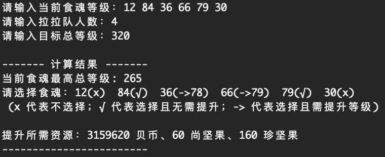
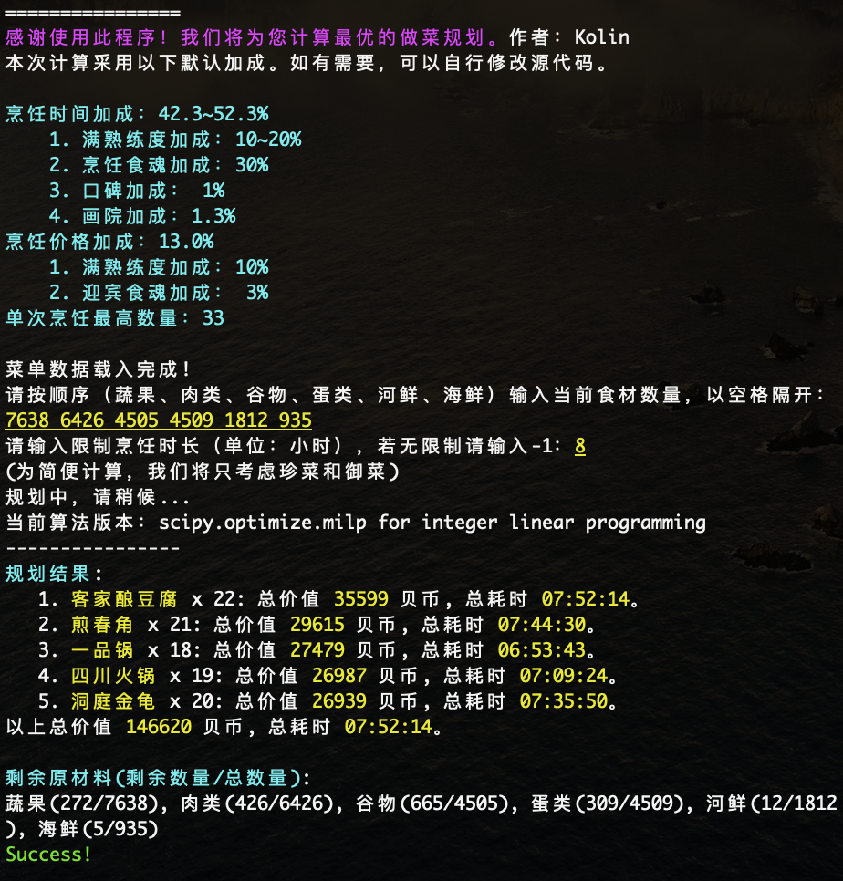

# 食物语游戏辅助工具


本工具包目前有以下功能

## 计算拉拉队所需的最少资源

部分活动需要在指定的六个食魂中选择四个并按照其四个的等级之和计算加成。本程序用于计算将食魂拉到指定等级之和所需要的资源最少的方案。

使用方法：

```shell
cd scripts
python compute_laladui.py
```

示例：




## 计算最优的做菜方案

输入当前所拥有的食材资源以及限定的烹饪时间（可选），自动规划收益最高的做菜方案。我们使用了`scipy.optimize.milp`函数来求解整数线性规划问题。如果报错无法导入该函数，请升级您的`scipy`版本。

使用方法：

```shell
cd scripts
python optimal_cooking.py
```

示例：



注：

1. 每个人的烹饪时间、菜品价值及单次烹饪上限加成都不一样。本程序按照上图中所列加成计算。如有需要，可以自行修改 [scipts/optimal_cooking.py, 第11-20行](./configs/chairs.json#11)。
2. 在少数情况下，部分菜品的烹饪时间会略高于输入的限额，但不会高太多。这个问题的原因是当前算法在处理多个不同位置烹饪同一种菜品的情况时，采用了一定程度的近似来简便计算。这个BUG可以改，但是有点麻烦，也没有必要。